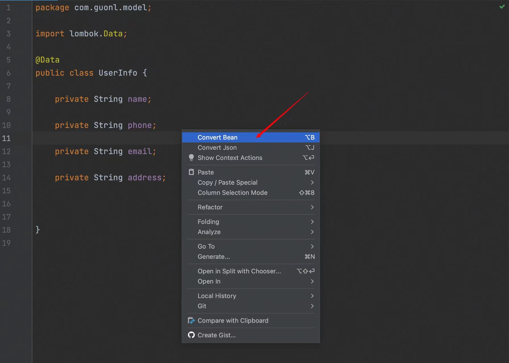
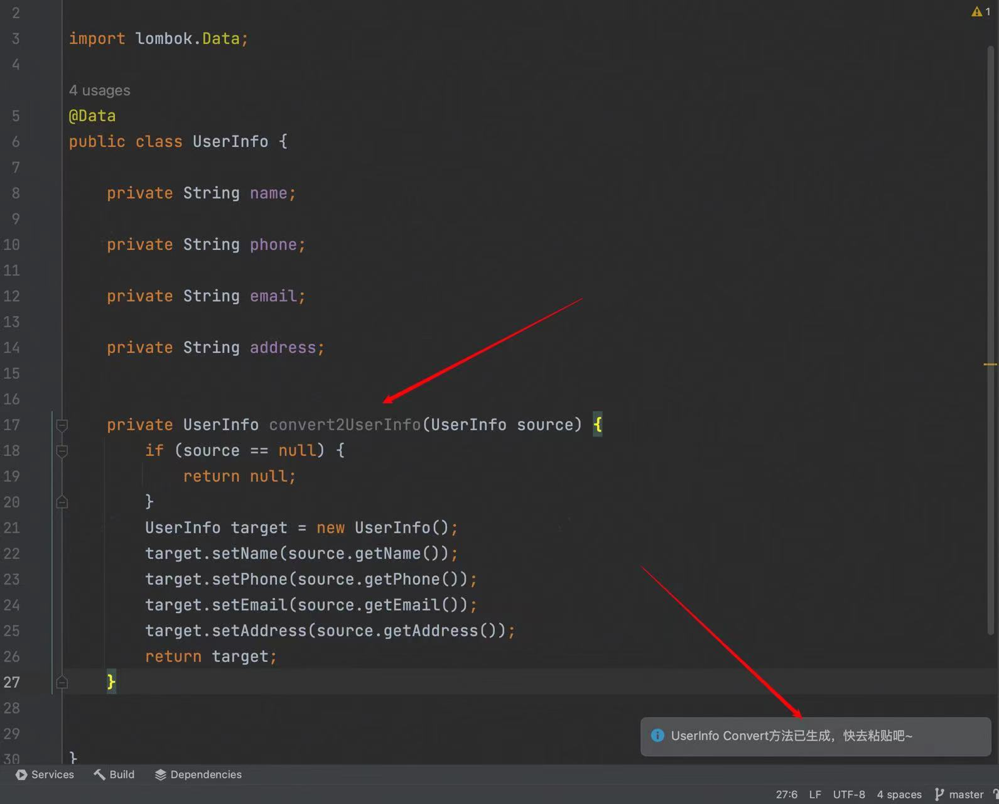
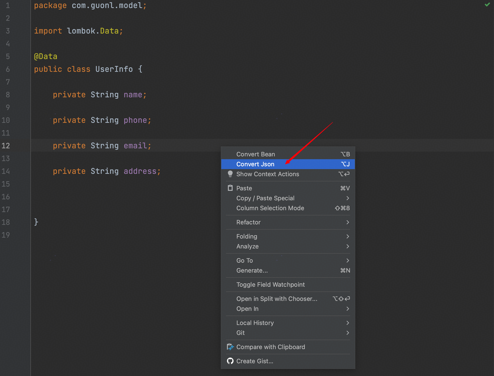

# 
 convert-bean-json

<!-- Plugin description -->
<h3>
convert-bean-json 是一款 IDEA 插件，它能够实现java对象相同属性之间的赋值，有点类似BeanUtils，
但是不同的地方在于字段的赋值是通过显式的方式，而不是通过反射。
这样实现的目的是为了方便后期定位问题，特别是在DDD的架构中，各个层级之间都有很多字段类似的转换对象，
通过这个工具，可以轻松实现对象间的字段赋值，手动精准控制每个字段的传递，极大地提高了开发的效率
</h3>

## 🍬 convert-bean-json 特性
- 快速生成convert方法，不需要手动get set；
- 根据bean的字段，快速转化为json格式，方便postman调试；
- ...更多特性敬请期待

<!-- Plugin description end -->

## 🌈 功能演示
### 1. bean copy to bean
打开对应的java类，在内部点击鼠标右键，然后点击右键菜单中的第一个`Convert Bean`  
或者使用快捷键：`alt + B` 或者 `option + B`

### 2. bean to json
打开对应的java类，在内部点击鼠标右键，然后点击右键菜单中的第二个`Convert Json`  
或者使用快捷键：`alt + J` 或者 `option + J`

## Thanks for free JetBrains Open Source license

